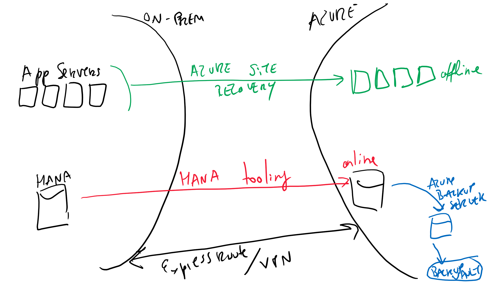

# HANA - HA and DR

## Recommended info

* [Channel 9 - SAP HANA on Azure Architecture Design - minute 48:00 onwards](https://channel9.msdn.com/Blogs/SAP-on-Azure/SAP-HANA-on-Azure-Architecture-Design)
* [https://docs.microsoft.com/en-us/azure/virtual-machines/workloads/sap/sap-hana-backup-guide](https://docs.microsoft.com/en-us/azure/virtual-machines/workloads/sap/sap-hana-backup-guide)

## Overview

HANA Backup/DR should be done using SAP tooling (eg: system replication).

Application servers can use Azure Site Recovery.

### Storage Replication

* DR system can be used for other purposes until needed
* Wastes more bandwidth than System Replication

### System Replication

* Best RPO and RTO
* Requires active connection 

## Tips

* [HANA] - Use smaller machine for DR and 